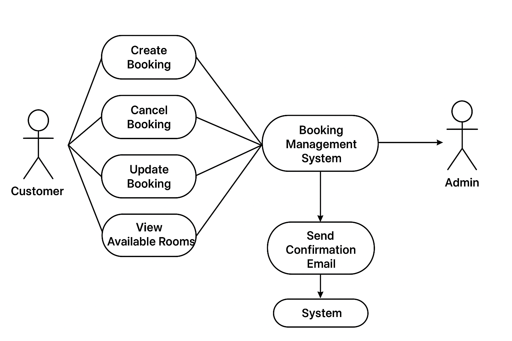

# Requirement Analysis in Software Development

## Introduction

This repository is created to document and explore the concept of Requirement Analysis in software development.  
Requirement analysis is the process of identifying, gathering, and defining what a software system should do. It helps developers, stakeholders, and clients understand the goals, features, and constraints of a system before development begins.

The goal of this repository is to:
- Explain the importance of requirement analysis in the software development lifecycle.
- Highlight the techniques and tools used for effective requirement gathering.
- Provide examples and templates for real-world projects.

## What is Requirement Analysis?
Requirement Analysis is the process of identifying, gathering, analyzing, and documenting the needs and expectations of stakeholders for a software system.  
It serves as the foundation for the entire software development process because it defines what the system should do and why it is being built.

## Importance of Requirement Analysis
Requirement analysis plays a crucial role in the Software Development Lifecycle (SDLC) because it directly influences the success or failure of a project. It ensures that the final product meets the user’s needs and business objectives.  

### Key Importance:
1. Clarity and Understanding  
2. Prevents Scope Creep  
3. Improves Communication  
4. Saves Time and Cost  
5. Provides a Basis for Design and Testing  

## Key Activities in Requirement Analysis
The process of Requirement Analysis involves several key activities that help ensure that software requirements are complete, accurate, and clearly understood by all stakeholders.

- Requirement Gathering  
- Requirement Elicitation  
- Requirement Documentation  
- Requirement Analysis and Modeling  
- Requirement Validation  

## Types of Requirements

### Functional Requirements
Functional requirements describe what the system should do — the specific features and behaviors that enable users to complete tasks.

Example (Booking Management System):
- Users should be able to create, update, and cancel bookings.  
- The system should send booking confirmation emails to users.  
- Admins should be able to view all active and past bookings.  
- The system should display available dates and rooms before confirming a booking.

### Non-functional Requirements
Non-functional requirements describe how the system should perform rather than what it does. They define the system’s quality attributes such as performance, security, and usability.

Example (Booking Management System):
- The system should handle up to 1,000 concurrent booking requests without lag.  
- Response time for user actions should not exceed 3 seconds.  
- User data should be encrypted and securely stored.

## Use Case Diagram

Use Case Diagrams are visual representations that show how users (actors) interact with a system to achieve specific goals. They help stakeholders and developers understand the system’s functional requirements at a high level.

### Example: Booking Management System

Actors:
- Customer: Makes and manages bookings.  
- Admin: Manages users, rooms, and booking records.  
- System: Sends notifications and stores data.  

Use Cases:
- Create Booking  
- Cancel Booking  
- Update Booking  
- View Available Rooms  
- Manage Bookings  
- Send Confirmation Email  

## Acceptance Criteria

Acceptance Criteria are a set of predefined conditions or requirements that must be met for a feature or system to be considered complete and acceptable by stakeholders. They help ensure that all parties have a shared understanding of what “done” means and prevent misunderstandings during development and testing.

### Importance of Acceptance Criteria
- They define clear expectations for features and functionalities.  
- Help developers and testers verify that the implementation meets user needs.  
- Ensure transparency and alignment between clients, developers, and testers.  
- Serve as a basis for user acceptance testing (UAT).

### Example: Checkout Feature (Booking Management System)

**Feature:** Checkout Process  

**Acceptance Criteria:**
1. The system must display a summary of all booked items before payment.  
2. Users must be able to choose a payment method (e.g., card, wallet, or bank transfer).  
3. Payment confirmation must be displayed after successful payment.  
4. An automated booking confirmation email must be sent to the user after checkout.  
5. The system should handle failed payments gracefully and prompt the user to retry.
